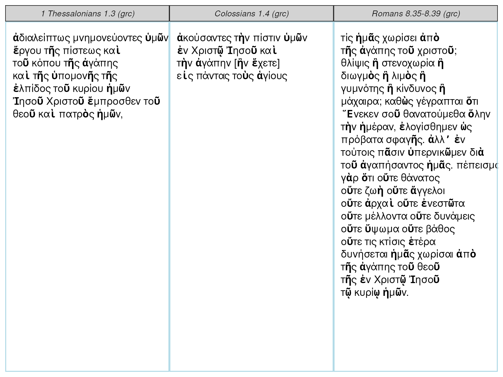

# rperseus Vignette

### Introduction

`rperseus` provides tools to get and analyze classical texts. Version
0.1.2 includes:

- `get_perseus_text`, a function to obtain a text from the Perseus
  Digital Library
- `perseus_parallel`, a function to render a text parallel in `ggplot2`
- `parse_excerpt`, a function to parse any Greek excerpt
- `perseus_catalog`, a data frame of available texts
- `greek_stop_words`, a data frame of Greek pronouns, articles,
  prepositions, and particles

``` r

library(rperseus)
head(perseus_catalog)
```

    ## # A tibble: 6 × 5
    ##   urn                                      group_name label description language
    ##   <chr>                                    <chr>      <chr> <chr>       <chr>   
    ## 1 urn:cts:latinLit:stoa0215b.stoa001.opp-… Orientius… Comm… Orientius … lat     
    ## 2 urn:cts:latinLit:stoa0215b.stoa002.opp-… Orientius… Carm… Orientius … lat     
    ## 3 urn:cts:latinLit:stoa0215b.stoa003.opp-… Orientius… Orat… Orientius … lat     
    ## 4 urn:cts:latinLit:phi9500.phi035.opp-lat1 Anonymous  Epit… Anonymous,… lat     
    ## 5 urn:cts:latinLit:tmp1347.tmp1347.opp-la… Columbanu… Epis… Columbanus… lat     
    ## 6 urn:cts:greekLit:tlg0082.tlg004.1st1K-g… Apolloniu… De c… Apollonius… grc

A snapshot of available authors:

``` r

library(dplyr)
count(perseus_catalog, group_name, sort = TRUE)
```

    ## # A tibble: 347 × 2
    ##    group_name        n
    ##    <chr>         <int>
    ##  1 Libanius        103
    ##  2 Galen           101
    ##  3 Hebrew Bible     79
    ##  4 Augustinus       70
    ##  5 Lysias           68
    ##  6 Homeric Hymns    66
    ##  7 Mishnah          63
    ##  8 Plato            62
    ##  9 Isocrates        60
    ## 10 Hieronymus       56
    ## # ℹ 337 more rows

### Getting a Text

Once you’ve identified the relevant URN, paste it into a call to
`get_perseus_text`. Here I’ve called for the Greek text of Plato’s
*Crito*:

``` r

crito <- get_perseus_text(urn = "urn:cts:greekLit:tlg0059.tlg003.perseus-grc2")
crito$text[1]
```

    ##                                                                                                                                                                                                                                                                                                                                                                                                                                                                                                                                                                                                                                                                                                                                                                                                                                                                                                                                                                                                                                                                                                                                                                                                                                                                                                                                                                                                                                                                                                                                                                                                                                                                                                    div 
    ## "ΣΩ. τί τηνικάδε ἀφῖξαι, ὦ Κρίτων; ἢ οὐ πρῲ ἔτι ἐστίν; ΚΡ. πάνυ μὲν οὖν. ΣΩ. πηνίκα μάλιστα; ΚΡ. ὄρθρος βαθύς. ΣΩ. θαυμάζω ὅπως ἠθέλησέ σοι ὁ τοῦ δεσμωτηρίου φύλαξ ὑπακοῦσαι. ΚΡ. συνήθης ἤδη μοί ἐστιν, ὦ Σώκρατες, διὰ τὸ πολλάκις δεῦρο φοιτᾶν, καί τι καὶ εὐεργέτηται ὑπʼ ἐμοῦ. ΣΩ. ἄρτι δὲ ἥκεις ἢ πάλαι; ΚΡ. ἐπιεικῶς πάλαι. ΣΩ. εἶτα πῶς οὐκ εὐθὺς ἐπήγειράς με, ἀλλὰ σιγῇ παρακάθησαι; ΚΡ. οὐ μὰ τὸν Δία, ὦ Σώκρατες, οὐδʼ ἂν αὐτὸς ἤθελον ἐν τοσαύτῃ τε ἀγρυπνίᾳ καὶ λύπῃ εἶναι, ἀλλὰ καὶ σοῦ πάλαι θαυμάζω αἰσθανόμενος ὡς ἡδέως καθεύδεις· καὶ ἐπίτηδές σε οὐκ ἤγειρον ἵνα ὡς ἥδιστα διάγῃς. καὶ πολλάκις μὲν δή σε καὶ πρότερον ἐν παντὶ τῷ βίῳ ηὐδαιμόνισα τοῦ τρόπου, πολὺ δὲ μάλιστα ἐν τῇ νῦν παρεστώσῃ συμφορᾷ, ὡς ῥᾳδίως αὐτὴν καὶ πρᾴως φέρεις. ΣΩ. καὶ γὰρ ἄν, ὦ Κρίτων, πλημμελὲς εἴη ἀγανακτεῖν τηλικοῦτον ὄντα εἰ δεῖ ἤδη τελευτᾶν. ΚΡ. καὶ ἄλλοι, ὦ Σώκρατες, τηλικοῦτοι ἐν τοιαύταις συμφοραῖς ἁλίσκονται, ἀλλʼ οὐδὲν αὐτοὺς ἐπιλύεται ἡ ἡλικία τὸ μὴ οὐχὶ ἀγανακτεῖν τῇ παρούσῃ τύχῃ. ΣΩ. ἔστι ταῦτα. ἀλλὰ τί δὴ οὕτω πρῲ ἀφῖξαι; ΚΡ. ἀγγελίαν, ὦ Σώκρατες, φέρων χαλεπήν, οὐ σοί, ὡς ἐμοὶ φαίνεται, ἀλλʼ ἐμοὶ καὶ τοῖς σοῖς ἐπιτηδείοις πᾶσιν καὶ χαλεπὴν καὶ βαρεῖαν, ἣν ἐγώ, ὡς ἐμοὶ δοκῶ, ἐν τοῖς βαρύτατʼ ἂν ἐνέγκαιμι. ΣΩ. τίνα ταύτην; ἢ τὸ πλοῖον ἀφῖκται ἐκ Δήλου, οὗ δεῖ ἀφικομένου τεθνάναι με; ΚΡ. οὔτοι δὴ ἀφῖκται, ἀλλὰ δοκεῖν μέν μοι ἥξει τήμερον ἐξ ὧν ἀπαγγέλλουσιν ἥκοντές τινες ἀπὸ Σουνίου καὶ καταλιπόντες ἐκεῖ αὐτό. δῆλον οὖν ἐκ τούτων τῶν ἀγγέλων ὅτι ἥξει τήμερον, καὶ ἀνάγκη δὴ εἰς αὔριον ἔσται, ὦ Σώκρατες, τὸν βίον σε τελευτᾶν. ΣΩ. ἀλλʼ, ὦ Κρίτων, τύχῃ ἀγαθῇ, εἰ ταύτῃ τοῖς θεοῖς φίλον, ταύτῃ ἔστω· οὐ μέντοι οἶμαι ἥξειν αὐτὸ τήμερον."

### Getting Multiple Texts with the tidyverse

You can collect all of Plato’s available English translations with the
`tidyverse:`

``` r

plato <- perseus_catalog %>% 
  filter(group_name == "Plato",
         language == "eng") %>% 
  pull(urn) %>% 
  map_df(get_perseus_text)
```

### Rendering Parallels

You can render small parallels with `perseus_parallel`:

``` r

tibble::tibble(label = c("Colossians", "1 Thessalonians", "Romans"),
              excerpt = c("1.4", "1.3", "8.35-8.39")) %>%
    dplyr::left_join(perseus_catalog) %>%
    dplyr::filter(language == "grc") %>%
    dplyr::select(urn, excerpt) %>%
    as.list() %>%
    purrr::pmap_df(get_perseus_text) %>%
    perseus_parallel(words_per_row = 4)
```

    ## Joining with `by = join_by(label)`



### Parsing Excerpts

You can parse any Greek excerpt with `parse_excerpt`. A data frame is
returned including part of speech, person, number, tense, mood, voice,
gender, case, and degree.

``` r

parse_excerpt("urn:cts:greekLit:tlg0031.tlg002.perseus-grc2", "5.1-5.3")
```

    ## # A tibble: 48 × 12
    ##    word  form  verse part_of_speech person number tense mood  voice gender case 
    ##    <chr> <chr> <chr> <chr>          <chr>  <chr>  <chr> <chr> <chr> <chr>  <chr>
    ##  1 καί   Καὶ   5.1   conjunction    NA     NA     NA    NA    NA    NA     NA   
    ##  2 ἔρχο… ἦλθον 5.1   verb           third  plural aori… indi… acti… NA     NA   
    ##  3 εἰς   εἰς   5.1   preposition    NA     NA     NA    NA    NA    NA     NA   
    ##  4 ὁ     τὸ    5.1   article        NA     singu… NA    NA    NA    neuter accu…
    ##  5 πέραν πέραν 5.1   adverb         NA     NA     NA    NA    NA    NA     NA   
    ##  6 ὁ     τῆς   5.1   article        NA     singu… NA    NA    NA    femin… gena…
    ##  7 θάλα… θαλά… 5.1   noun           NA     singu… NA    NA    NA    femin… gena…
    ##  8 εἰς   εἰς   5.1   preposition    NA     NA     NA    NA    NA    NA     NA   
    ##  9 ὁ     τὴν   5.1   article        NA     singu… NA    NA    NA    femin… accu…
    ## 10 χώρα  χώραν 5.1   noun           NA     singu… NA    NA    NA    femin… accu…
    ## # ℹ 38 more rows
    ## # ℹ 1 more variable: degree <chr>
